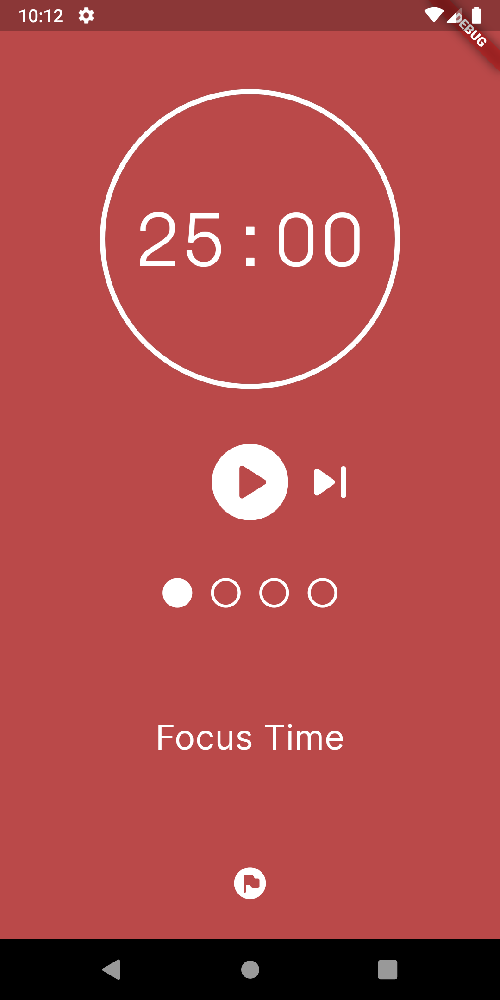
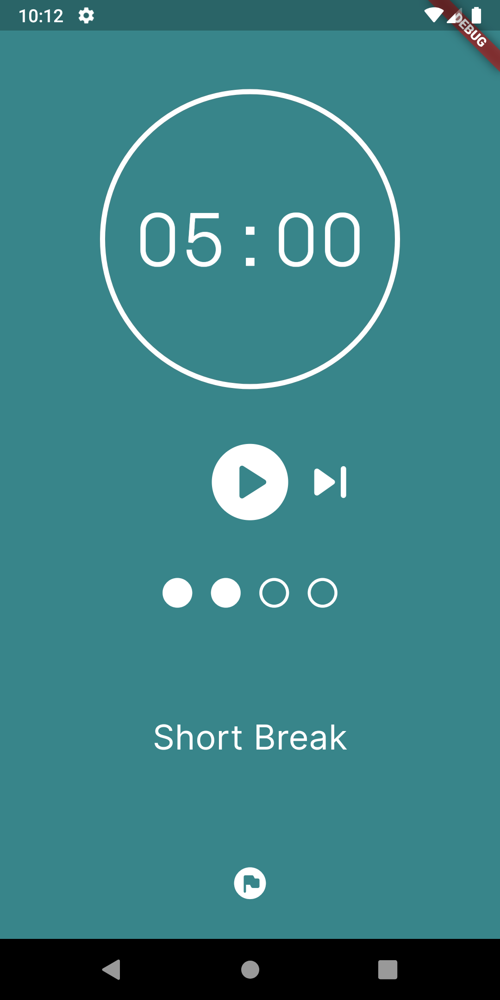
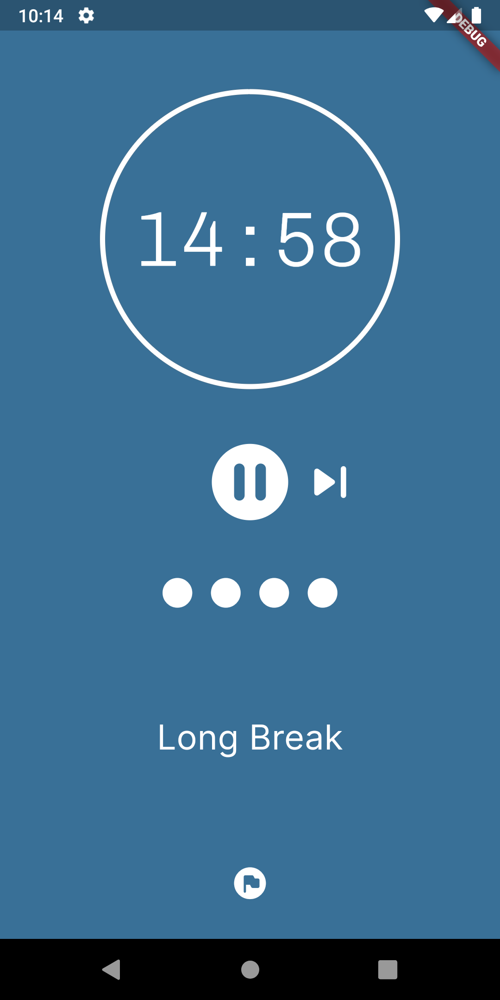

# Flutter Pomodoro

Bem-vindo ao **Flutter Pomodoro**!

O **Flutter Pomodoro** é um aplicativo de gerenciamento de tempo desenvolvido com Flutter, trazendo para você a praticidade e a eficiência do método Pomodoro diretamente para o seu dispositivo móvel. Este projeto foi inspirado em um design encontrado no Figma(https://www.figma.com/community/file/1235238751721231862/pomodoro-app) e totalmente desenvolvido por mim, utilizando o poderoso framework Flutter.

## Por que Flutter Pomodoro?

Este aplicativo é mais do que apenas um temporizador - é a união perfeita entre a flexibilidade do Flutter e a elegância do design Figma. Cada aspecto do aplicativo foi cuidadosamente construído para proporcionar uma experiência de usuário fluida e agradável, enquanto mantém a simplicidade e a eficácia do método Pomodoro.

## Recursos Principais

- **Temporizador Pomodoro Customizável:** Configure facilmente o tempo de trabalho e os intervalos de descanso de acordo com suas preferências.
- **Design Inspirado no Figma:** Inspirado em um design encontrado no Figma, cada elemento do aplicativo foi replicado e adaptado para garantir uma experiência visualmente atraente.

## Como Utilizar

1. Inicie uma sessão de trabalho e concentre-se em sua tarefa até que o tempo expire.
2. Aproveite o intervalo de descanso para recarregar suas energias.
3. Repita o processo para aumentar sua produtividade e alcançar seus objetivos!

## Conclusão

O **Flutter Pomodoro** é o resultado do meu compromisso em fornecer soluções práticas e eficientes para o dia a dia. Seja você um estudante, um profissional ou alguém em busca de uma maneira mais inteligente de gerenciar o tempo, o **Flutter Pomodoro** está aqui para ajudar, criado com dedicação e paixão pela tecnologia Flutter.
